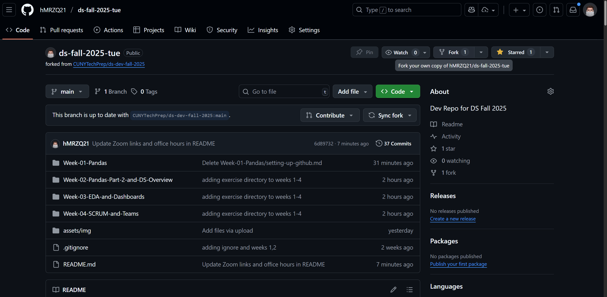
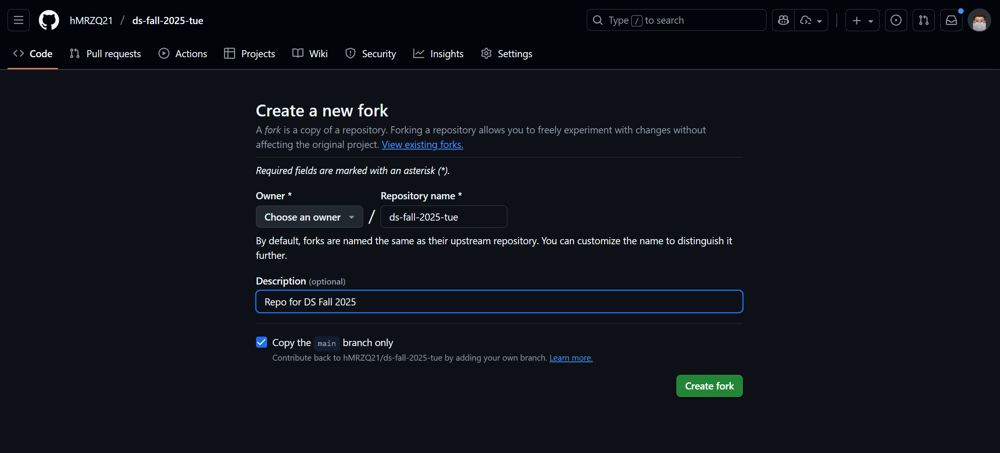
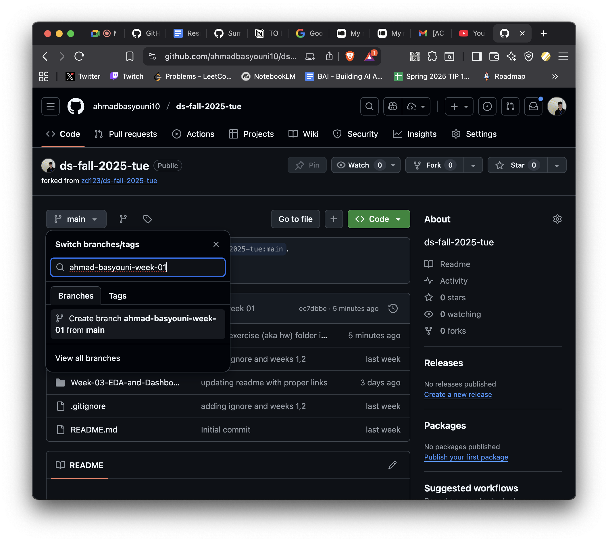
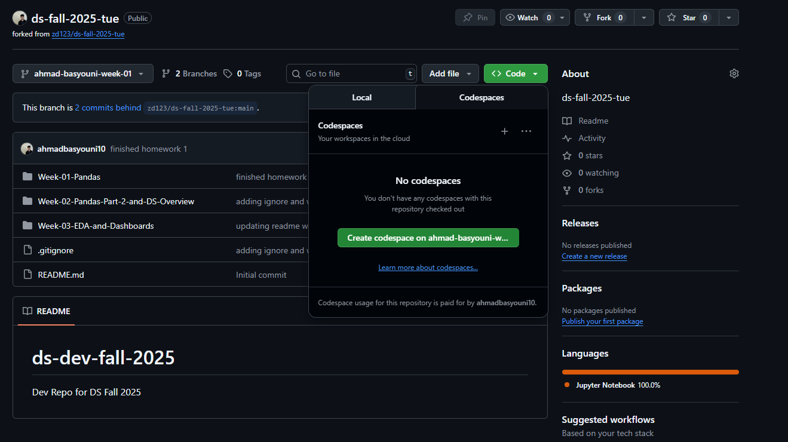
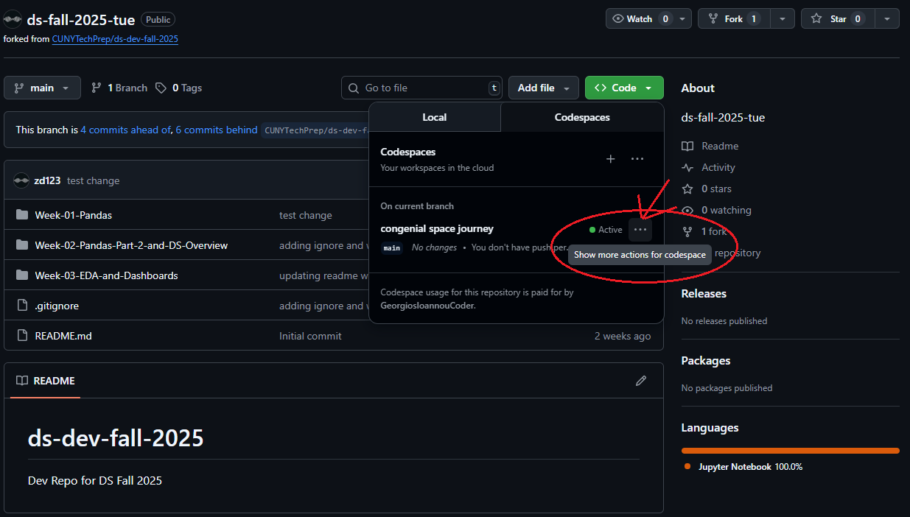
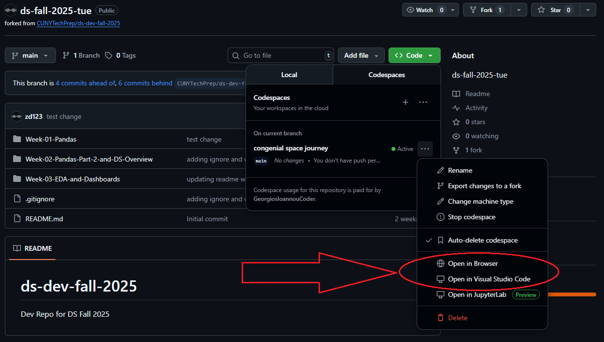
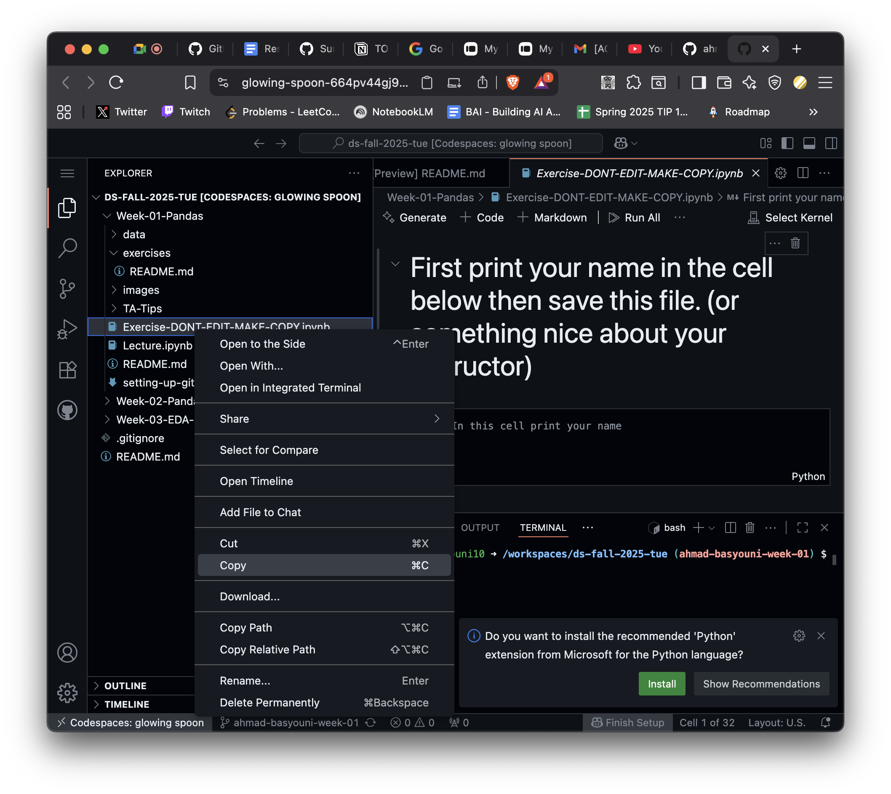
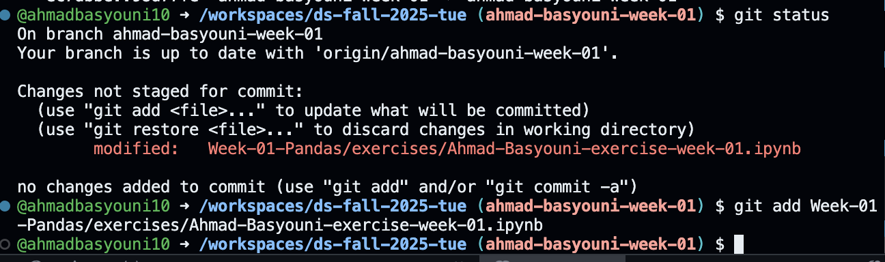
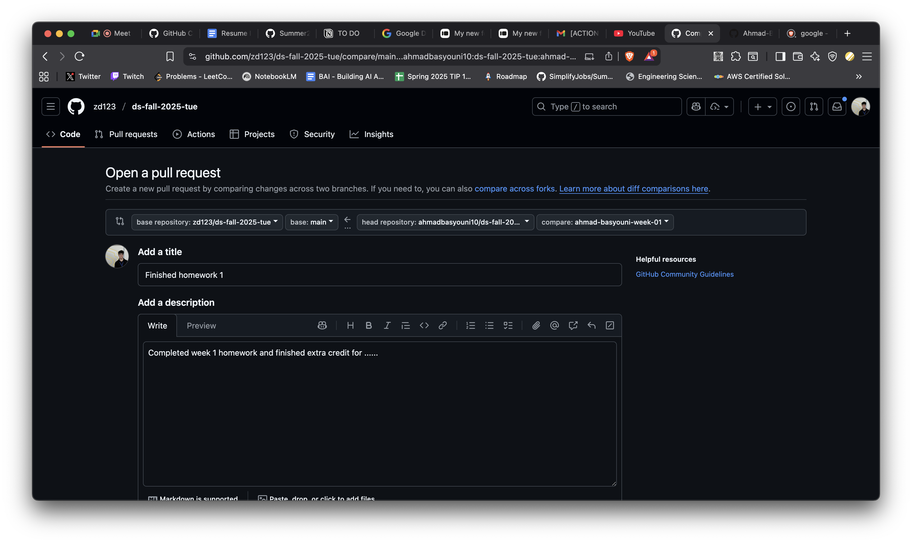
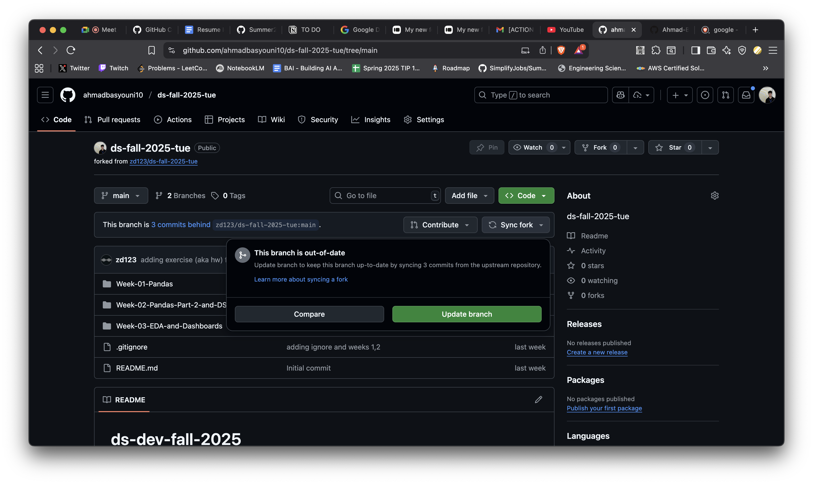

# CTP Fall Data Science 2025 

### Zoom Links 
* [Tuesday   06:30 PM - 9:00 PM](https://us02web.zoom.us/j/81512566867?pwd=gRmOCv1vUDzM764HaZLlguGnWQnzr3.1)
* [Wednesday 06:00 PM - 8:30 PM](https://us02web.zoom.us/j/85654459409?pwd=KnAv3QSawnXZ6b2bMdz4W5rApKNrZK.1) 
* [Friday    12:30 PM - 3:00 PM](https://us02web.zoom.us/j/89154679761?pwd=hSEbt2GEo4WPRnO2dQURhuG9blWnED.1)
* [Friday    06:30 PM - 9:00 PM](https://us02web.zoom.us/j/89892493674?pwd=vnQAVLQmIbuH7vF30D12cCpXvYI5CO.1)

### Lecture Recordings 
[Links to Lecture Recordings](https://drive.google.com/drive/folders/1i4LCYMPpViZcsd1pTAuscS2IDt5PmPw6) 
- If you dont have permission to view doc you are using the wrong email.

## [HW Submission Form](https://forms.gle/Ea1TnJ6D2NT6otBV9)
* You fill this out for each individual HW assignment
* HW assignments can be found inside each week's `README`.

### Office Hours
* Georgios Ioannou: DM to set up a meeting
* Ahmad Basyouni:
* Hussam Marzooq: Fridays 07:00 PM - 08:00 PM
* Jessica Lau: DM to set up a meeting
* Kevin Li: Fridays 09:00 PM -10:00 PM

# Syllabus

* Week 01 (Week of Aug 25): Pandas 1 [~1hr]  &&  Proper Github Workflow in class. [~1hr]
* Week 02 (Week of Sep 01): Pandas 2
* Week 03 (Week of Sep 08): EDA // Data Viz // Dashboards
* Week 04 (Week of Sep 15): Career Counselor Lecture [~1hr] && Real World Work && Making Teams
* Week XX (Week of Sep 22): No Class
* Week 05 (Week of Sep 29): Stats and Business Analytics 
* Week 06 (Week of Oct 06): Regressors via Linear Regression 
* Week 07 (Week of Oct 13): Classifiers via Logistic Regression 
* Week 08 (Week of Oct 20): Decision Trees / Random Forest 
* Week 09 (Week of Oct 27): Thinking Like a Data Scientist and Vibe Coding
* Week 10 (Week of Nov 03): AI Part 1
* Week 11 (Week of Nov 10): Career Counselor Lecture [~1hr] & AI Part 2
* Week 12 (Week of Nov 17): Deployment
* Week XX (Week of Nov 24): No Class
* Week 13 (Week of Dec 01): FINAL PRESENTATIONS

_*Syllabus and topics are subject to change_

# Setup Instructions (Github and Homeworks)

## Getting Started (PLEASE READ THIS CAREFULLY TO SET YOURSELF UP FOR SUCCESS THIS SEMESTER)
1. Fork the class’ main repository to your own GitHub account `ds-fall-2025-YOUR_CLASS_SECTION`.



2. Every week go to your forked repo and create a branch `firstname-lastname-week-XX` XX is the week number, eg: ahmad-basyouni-week-01


3. Press on the code button in your new fork and select Codespaces, then select `Create codespace on firstname-lastname-week-XX`


4. Go into this week’s folder in the new tab that opens

5. Once you have created your codespace and is running on the new tab, then you have the option to open it in your local VSCode by clicking on the three dots



6. For homework, make a copy of the exercise notebook (don’t edit the original—make your own copy!) and paste it in the `exercise` folder


7. Name it `firstname-lastname-exercise-week-XX.ipynb`

8. Do the exercise and run all the cells, make sure no errors

9. When you are done, run these commands:
    - `git status` to see your file you need to add
    - `git add` your new file name, should look something like this:
        - `git add Week-01-Pandas/exercise/Ahmad-Basyouni-exercise-week-01.ipynb`
    - `git commit -m “your message here”`
    - `git push origin firstname-lastname-week-XX`
  


10. Go back to your class main repository on GitHub. You’ll see a prompt to create a Pull Request (PR) for your branch `Compare & Pull Request`. If you don’t see it, press on Contribute and make a PR through there.

11. Write a short description of what you did and if you completed any extra credit (e.g., “Completed week 1 homework and finished extra credit for ......“).


12. Submit the PR by pressing `Create Pull Request`. We’ll review your work and leave comments if anything needs fixing. Once it’s approved, we’ll merge it. You don’t need to merge it yourself—just wait for review and feedback.

13. From now on, in the beginning of every class make sure to pull all changes from the parent repo, so before making a new branch for the current week, go to main branch in your fork repo and do `Sync Fork` then `Update Branch`


14. Now you are ready to start from step 0, by making new branch for the current week and do the work like described above in order. Happy coding!

## Homework Submission
- All homework is due at 12:01 PM (noon) the day before the next class
- Submit GitHub PR links to your completed exercise
# Homework Instructions: How to hand in your HWs.
__HW assignments can be found in that each weeks README.md file. Open that weeks folder to find assignment__

__All HWs are due at 12:01 PM (noon) the day before the next class__

* Tuesday class: HW due 12:01 PM on Monday
* Wednesday class: HW due 12:01 PM on Tuesday
* Fridays (both 12:30 PM and 06:30 PM): HW due 12:01 PM on Thursday

__Submit your HW assignments to the form below:__
* [Main HW submission form](https://forms.gle/Ea1TnJ6D2NT6otBV9)
* Further instructions are inside the form.


## There are usually 3 sections of HW every week.

### #1 Pre-Class HW [~1hr]
This covers the topic we are about to teach.  This is HW that will help you come to class better prepared to learn the material that week. 
* Watch / read / do the tutorial listed above. 
* Go to your class slack channel.  
* Find the usually most recent message from your TA instructor that says "Week X: Pre-Class learnings". 
* Respond in-thread to that message with least one thing you learned from the videos/reading/or tutorial. 
	* Your response can be It can be as short as one sentence, or as long as a book. 
* Still in Slack, copy the link to your response. 
* Pasted that to your response in HW Submission sheets Pre-Class column for that week.

__Submit by pasting the link to your message under the "Pre-Class Slack Link" column.__ 

### #2 Exercise HW [~1hr]
This is a coding assignment that you usually start in class.  It is located in the `Exercise-DONT-EDIT-MAKE-COPY.ipynb` file.  See detaild instructions below. (Paste link in HW Submission sheet.)

0. Make a copy of `Exercise-DONT-EDIT-MAKE-COPY.ipynb`
0. Name the new copy as `Exercise-[YOUR-INITIALS].ipynb`. Zack DeSario's would be `Exercise-ZD.ipynb`.
0. Complete all the questions in YOUR COPY of the exercise file.
0. Push that file to your fork. 
    ```bash
    ## NEVER DO --> git add .
    git add YOUR-EXERCISE-FILE.ipynb
    git commit -m 'YOUR COMMIT MESSAGE'
    git push
    ```
0. Open your github fork on the internet, click on your HW file you just pushed. Copy that exact link. 
0. Copy that exact link, and paste it into the HW submission sheet in the Exercise column for that week. 

__Submit by pasting the link in the HW Submission sheet under the "Exercise.ipynb" column.__

### #3 LinkedIn Post [~10min]
Every week you have to post on LinkedIn. It can be anthing data science related unless instructed otherwise. 

Publish the post (make sure its a public post.) 

If no specific post topic is given that week, here are some topic ideas you can use. 
* It can be about starting your CTP journey. 
* Asking for advice on most important things to learn for entry level roles. 
* Something you leanred in the pre-class videos. 
* Why you love or hate pandas. 
* Your favorite part about the class. 
* A tip or trick that your learned in class. 
* Anything related to data science or your journey. 

Submit by putting the link to your LI post under the "LinkedIn Post" column. 
